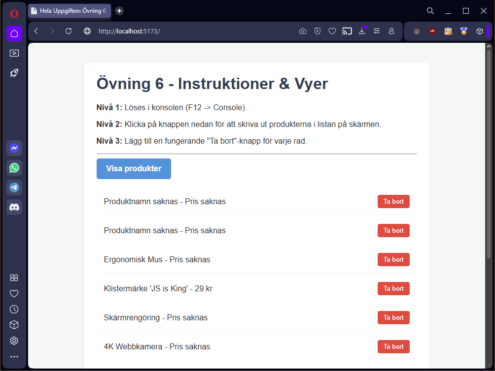

# Exercise 6: "The Shopping Cart" (DOM Manipulation)

**Program:** Lexicon / LTU (VT-2026) 
**Course:** JavaScript Basics & DOM Manipulation
**Tags:** `javascript` `es6` `dom` `event-handling` `array-methods` `vite`

---



## Project Purpose
The purpose of this project is to build an interactive e-commerce shopping cart dashboard using modern JavaScript (ES6+) and DOM manipulation techniques. Starting from a static dataset of products, the application implements core programmatic logic to filter item arrays, map out raw data structures, and aggregate cumulative metrics. Moving beyond the browser console, the project builds an interactive frontend layout that listens for UI events, dynamically renders reactive list nodes into the DOM tree, and catches native event objects to handle localized node deletion safely.

## Core Technologies
* **JavaScript (ES6+):** Functional programming architecture using modern array methods (`.filter()`, `.map()`, `.reduce()`), block-scoped storage primitives (`const`, `let`), and modular arrow functions.
* **DOM API:** Interactive webpage traversal via element selection methods (`querySelector`), live element generation (`createElement`), text population (`textContent`), styling manipulation (`style.color`), and node termination (`.remove()`).
* **Event Handling:** Non-blocking interface interaction utilizing click event listeners (`addEventListener`) and runtime structural inspection via event targets (`e.target`).
* **Vite:** High-performance local development build tool providing Hot Module Replacement (HMR) and production asset bundling.

## Project Structure
The project source code lives in the `src/` directory, while the production-ready assets are generated inside the `dist/` folder.

```text
/root
 ├── dist/                  # Generated upon production build (tracked in .gitignore)
 ├── docs/                  # Assignment documentation, guidelines, and learning resources
 │   ├── examples/          # Reference environment and demo blueprints
 │   │   ├── demo.html      # Demo environment page for manual testing
 │   │   └── demo.js        # Baseline code showcase (Scope, Arrays, DOM Event targets)
 │   ├── exercise/          # Core task assignment instructions
 │   │   ├── exercise-06.html
 │   │   └── exercise-06.pdf
 │   └── theory/            # Educational background material
 │       └── javascript.pdf # JavaScript language reference and theoretical guidelines
 ├── src/                   # Source files (Vite root directory)
 │   ├── assets/            # Main project assets
 │   │   ├── scripts/       # Primary JavaScript files
 │   │   │   └── main.js
 │   │   └── styles/        # Application stylesheets
 │   │       └── main.css
 │   ├── public/            # Static assets copied directly to dist root
 │   │   └── robots.txt
 │   └── index.html         # Main HTML application entry point
 ├── .browserslistrc        # Target browsers configuration for PostCSS
 ├── .gitignore
 ├── package.json
 ├── postcss.config.js      # PostCSS styling pipeline config
 ├── preview.png            # Project screenshot for repository overview
 ├── README.md              # Current project documentation file
 └── vite.config.js         # Vite automation server configuration
```

## Core Assignment Levels

### Level 1: Core JS & Array Methods
The initial level handles core array transformation, scoped data storage, and function declaration inside the browser console:
* **Filtering Arrays:** Uses `.filter()` to extract specific item collections matching predefined classifications (e.g., separating out `"Hårdvara"` dependencies).
* **Mapping Structures:** Uses `.map()` alongside text casing metrics (`.toUpperCase()`) to output standardized literal strings.
* **Aggregating Values:** Uses `.reduce()` initialized with a neutral starting pivot to sum up multi-layered computational properties (such as cumulative inventory prices).

### Level 2: DOM Manipulation & Click Events
This level connects algorithmic variables directly to user-facing interface elements:
* **Interactive Elements:** Connects trigger elements (`<button id="btn-visa">`) to dedicated output arrays (`<ul id="produkt-lista">`).
* **Dynamic Node Injection:** Listens for active element clicks to iteratively parse underlying objects, instantiate fresh structural tags (`<li>`), and seamlessly pipe localized textual records to the screen.

### Level 3: Full Interactivity & Event Capture
The final level utilizes the event runtime loop to configure micro-interactions across variable application instances:
* **Dynamic Component Attachment:** Generates independent removal components alongside appended elements programmatically during list generation loops.
* **Target Isolation:** Captures programmatic event states (`e.target`) on active interactive components to seamlessly trace ancestor wrappers (`.parentElement`) and safely remove targeted nodes from the document tree.

## Getting Started
Follow these steps to install the necessary dependencies and run the project locally.

### 1. Install Dependencies
Before running the project for the first time, install all required packages:
```bash
npm install
```

### 2. Start the Development Server
To launch the local development server with Hot Module Replacement (HMR), run:
```bash
npm run dev
```
Click the `http://localhost:5173` link displayed in your terminal to open the project in your browser. Any changes made to the source files will reflect instantly without requiring a manual page reload.

### 3. Build for Production
When the project is complete and ready for deployment, generate the optimized, minified production assets by running:
```bash
npm run build
```
The compiled files will be outputted to the `dist/` directory.

### 4. Preview the Production Build
To verify that the production build in the `dist/` directory works exactly as expected before deploying, you can spin up a local preview server:
```bash
npm run preview
```
